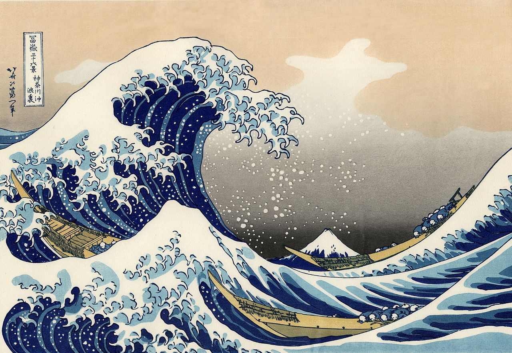
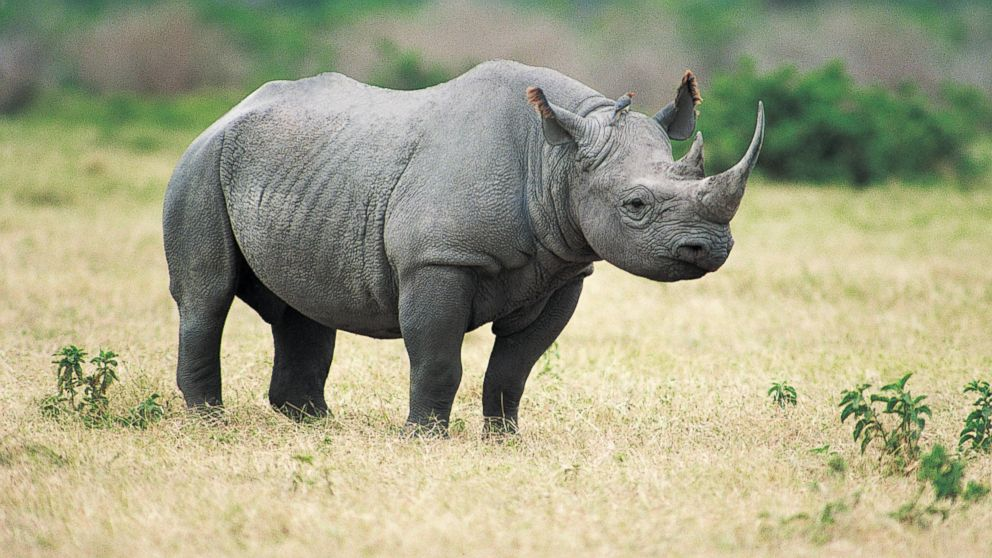

# quart: quadtree art  

`quart` generates computer art using concepts related to a [quadtree data structure][quadtree]. Based on a similar project, `quart` takes an image as input and then splits the image into four quadrants. Each quadrant is filled with its average color and the [mean squared error][magic] relative to each pixel and the estimated value is calculated. A large mean squared error correlates with a more detailed quadrant and the model recursively splits quadrants with the highest measure. The number of iterations is specified by the user. 

## usage  
```
usage: quadtree.py [-h] [-g] image_path iterations scale  
Generate quadtree computer art given a seed image.  
positional arguments:
  image_path  the path to the image file
  iterations  the number of iterations the model performs
  scale       the factor by which to scale the output image
optional arguments:
  -h, --help  show this help message and exit
  -g, --gif   generate a gif of each iteration
```

## dependencies  

`quart` uses the [ImageMagick][magic] `convert` command to generate GIFs. Please install ImageMagick if you wish to convert `quart` frames into GIFs.  

## examples







[magic]:http://www.imagemagick.org/script/index.php
[quadtree]:https://en.wikipedia.org/wiki/Quadtree
[mse]:https://en.wikipedia.org/wiki/Mean_squared_error